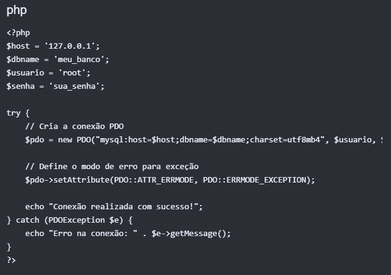

# Pesquisa PDO(PHP Data Objects)

## O que é? 

Basicamente o PDO(PHP Data Objects) é uma extensão da lingugagem PHP que define uma interface leve e consistente para acessar o banco de dados.

- Mas então o PDO é um padrão de conexão orientado a objetos.
- Funciona como uma camada de abstração de acessão a dados. 
- Permite usar a mesma sintaxe para diferentes bancos de dados (como MySQL, PostgreSQL, SQLite e Oracle).

## Para que ele é utilizado?

De uma forma bem simples o PDO é uitlizado para conectar e manpular bancos de dados em aplicações PHP de forma padronizada e segura.

Principais funções que o PDO faz:

- Abstração de acesso: Permite usar a mesma interface e os mesmos métodos para diferentes bancos de dados.
- Segurança contra injeção SQL: Suporta consultas preparadas(prepared statements) que separam o código SQL dos dados enviados pelo usuário.
- Orientação a Objetos: Utiliza classes e métodos modernos para gerencias conexões, consultas e transações.
- Controle de Transações: Facilita o agrupamento de oprações no banco, garantindo que todas sejam concluídas com sucesso ou revertidas em caso de erro.

Mas por que utilizar ele então de fato?

- Antes da chegada do PDO, a linguagem PHP oferecia suporte à comunicação com diferentes modelos de SGBD através de módulos específicos.

- A maioria deles provia uma biblioteca de funções e utilizava um resource para representar a conexão e outro para representar um resultset (o resultado de uma consulta). As operações eram feitas sobre as variáveis de resource.

- Cada driver implementava suas operações conforme imaginavam ser mais adequados. Embora alguns deles tivessem um funcionamento semelhante, a ordem dos parâmetros nem sempre era a mesma e podia causar uma certa confusão entre programadores.

### Bancos de dados suportados pelo PDO:

O PDO possui suporte aos principais banco de dados relacionais do mercado. Esse suporte é possível devido ao conceito de Driver que ele utiliza. Basicamente um driver é uma extensão que instalamos no PHP e que indica como o PDO vai se comunicar com aquele banco de dados em especifico.

Principais Drivers disponíveis: 

- MySQL
- SQL Server
- PostgreSQL
- Oracle
- SQLite

## Como funciona a conexão utilizando PDO?

A conexão com o banco de dados usando PDO (PHP Data Objects) funciona através da criação de uma instancia de classe PDO, passando uma string de conexão (DSN), o usuário e senha.

Mas então como criar uma conexão básica?

A extensão principal do PDO jávem atividada por padrão no PHP. O que precisamos é na verdade, ativar a extensão do driver do SGBD que vamos utilizar.

Mas para garantir a segurança e tratar falhas de comunicação com o servidor, a instanciação do PDO deve ser feita dentro de uma estrutura try-catch e no código é assim:

Comandos importantes:

- try/catch: Captura os erros caso a conexão falhe, evitando expor dados sensíveis na tela.
- setAttribute: Configura o PDO para lançar exceções se houver erros em comandos SQL.
- charset=utf8mb4: Garante o suporte correto a acentos e emojis.

### Como conectar o Banco MySQL usando o PDO (segundo o site localweb):

Testando a conexão

 <?php
  $banco = new PDO('mysql:host=localhost;dbname=nome_do_banco', 'username','password')or print (mysql_error());
  print "Conexão Efetuada com sucesso!";
  ?>

Incluir dados

<?php
  $banco = new PDO('mysql:host=localhost;dbname=nome_do_banco', 'username','password');
  $novo_cliente = array('nome'=>'José','departamento'=>'TI','unidade'=>'Paulista');
  $banco->prepare('INSERT INTO clientes (nome,departamento,unidade) VALUES (:nome,:departamento,:unidade)')->execute($novo_cliente);
  ?>

Pesquisar dados em base MySQL utilizando querys simples e stored procedures

Neste exemplo, é possível efetuar pesquisas em bases MySQL utilizando querys e stored procedures. Lembrando que para evitar conflitos, teste sua procedure antes de implementá-la em sua aplicação.

<?php
 
//Dados de acesso
$host = "Nome_do_Host";
$dbn  = "Nome_da_Base";
$user = "Nome_do_Usuário";
$pass = "Senha_da_Base";
 
$tabela = "Nome_da_Tabela";
 
try
{
	//Conectar
	$ligacao = new PDO("mysql:dbname=$dbn; host=$host", $user, $pass);
	$ligacao->setAttribute(PDO::ATTR_ERRMODE, PDO::ERRMODE_EXCEPTION);
 
	//Em caso de pesquisas, via procedures
	//$pesq = "";
	//$sql = "CALL Nome_da_procedure()";
 
	//Em caso de querys
	$pesq = "Nome_do_Campo";
	$sql = "SELECT * FROM $tabela WHERE nome= :nome_param";
 
	$resultados = $ligacao->prepare($sql);
 
	//Definição de parâmetros
	$resultados->bindParam(":nome_param", $pesq, PDO::PARAM_STR);
	$resultados->execute();
 
	echo'
'.$sql.'

';
 
	foreach($resultados as $linha)
	{
		echo '
';
		//Nome do campo na tabela pesquisada
		echo $linha["Nome_da_Coluna"];
		echo '
';
	}
 
	echo '

Resultados: '.$resultados->rowCount().'
';
 
	//Desconectar
	$ligacao = null;
}
catch(PDOException $erro)
{
	echo $erro->getMessage();
}
 
?>

#### Como conectar um banco SQL Server usando PDO (Windows)

Ainda segundo o site localWeb: funciona assim para conectar o banco usando PDO no windows:

<?php
try {
    $hostname = "sqlserver01.bancodedados.com";
    $dbname = "nomebanco";
    $username = "nomebanco";
    $pw = "senha";
    $pdo = new PDO ("mssql:host=$hostname;dbname=$dbname","$username","$pw");
  } catch (PDOException $e) {
    echo "Erro de Conexão " . $e->getMessage() . "\n";
    exit;
  }
      $query = $pdo->prepare("select Coluna FROM nome_tabela");
      $query->execute();
 
      for($i=0; $row = $query->fetch(); $i++){
        echo $i." - ".$row['Coluna']." ";
      }
 
      unset($pdo); 
      unset($query);
?>

Então basicamente nós conseguimos concluir que toda a conexão tem todo um processo bem complexo mas garante muito bem a segurança e também permite escolhermos o banco de dados que queremos utilizar entre outra diversas vantagens, que seram desenolvidas durante a pesquisa.

## Quais são as suas principais características?

As suas princpais caracteristica são: 

- Interface Unificada: Usa os memsmos métodos para conectar e consultar diferentes sistemas de banco de dados.
- Orientação objetos: Todo o seu funcionamento é baseado em classes e objetos, facilitando a organização do código.
- Consultas Parametrizadas (Prepared Statements): Protege a aplicação contra ataques de injeção de SQL ao separar os dados enviados pelo usuário da estrutura do comando SQL.
- Tratamento de Exceções: Permite capturar erros de banco de dados usando blocos try/catch, facilitando a depuração de falhas.
- Suporte a transações: Controla operações complexas em lote, permitindo confirmar que é commit ou desfazer que é rollBack alterações para garantir a integridade dos dados.
- Desempenho elevado: É desenvolvido nativamente em Linguagens C e integrado ao núcleo do PHP.

## Diferenças entre PDO e MYSQLI

O PDO é uma excelente escolha quando você precisa de uma camada de abstração segura, flexível e padronizada para interagir com bancos de dados em PHP.
O MySQLi é a escolha ideal quando o foco é alta performance e integração direta com o banco de dados MySQL em aplicações PHP, oferecendo uma abordagem nativa, eficiente e flexível.
A principal diferença entre os dois é que p PDO consegue interagir com outros tipos de banco de dados, já o mysqli apenas interage com o myslq.

## Opinião da Comunidade
"Entre as duas opções eu dou preferência ao PDO, mesmo sendo um pouco mais lento (entre 2%-7%). Ao meu ver, o fato do PDO se comunicar com mais drivers de BDs e de possuir prepared statements, que é de grande valia quando o assunto é segurança, na minha opinião torna esta tecnologia mais interessante."
— (Comentário de um programador no Stack Overflow)

## Vantagens e Desvantagens de utilizar PDO?

### MySQLi

## Vantagens:
- Desempenho ligeiramente superior  em ambientes exclusivos para MySQL.
- Suporta paradigmas Orientado a Objetos e Procedural.
- Desvantagens:
- Funciona apenas com o banco de dados MySQL.

### PDO (PHP Data Objects)

## Vantagens:
- Suporta múltiplos bancos de dados.
- Suporte nativo a prepared statements.
- Desvantagens:
- Não tão veloz quanto MySQLi.
- Por padrão, ele simula prepared statements (você pode ativar a versão nativa ao configurar a conexão dele com o banco, mas caso a versão nativa não funcione por algum motivo, ele volta a simular os prepared statements sem disparar erros ou avisos).

## O que são Prepared Statements e por que são importantes?

- Prepared Statements preparam a estrutura da consulta SQL no banco antes de enviar os dados reais. Isso garante segurança, pois o banco trata os dados apenas como texto literal, prevenindo ataques de SQL Injection. Além disso, oferecem melhor desempenho ao reaproveitar o plano de execução para consultas repetidas. Em resumo: dividem a busca em preparação, vinculação de valores e execução. 

// 1. Preparação (usando :email como placeholder)
$stmt = $pdo->prepare('SELECT * FROM usuarios WHERE email = :email');
// 2. Vinculação e Execução segura
$stmt->execute(['email' => $emailDoUsuario]);
$usuario = $stmt->fetch();

## Em quais situações o PDO pode ser uma boa escolha?
### O PDO é a escolha ideal principalmente nestas situações:

- Sistemas Multi-Banco: Projetos que precisam (ou podem precisar no futuro) alternar entre diferentes bancos de dados (como MySQL, PostgreSQL, SQLite ou SQL Server) sem a necessidade de reescrever todas as consultas da aplicação.

- Projetos Orientados a Objetos (POO): Aplicações construídas com arquitetura POO moderna ou frameworks PHP (como Laravel e Symfony), onde a padronização e o reuso de código são prioritários.

- Segurança e Padronização: Ambientes onde se busca uma interface unificada e segura para tratamento de erros via exceções e suporte nativo e consistente a Prepared Statements.

Fontes: https://www.php.net/manual/pt_BR/book.pdo.php
        https://www.gigasystems.com.br/artigo/52/conexao-com-mysql-e-pdo-no-php
        https://www.devmedia.com.br/introducao-ao-php-data-objects-pdo/25318
        https://www.treinaweb.com.br/blog/o-que-e-pdo-no-php
        https://www.locaweb.com.br/ajuda/wiki/tudo-sobre-o-php-data-object-pdo-hospedagem-de-sites/
        https://www.guj.com.br/t/o-que-e-preparedstatement-e-para-que-serve/86774/
        https://pt.stackoverflow.com/questions/8302/mysqli-vs-pdo-qual-o-mais-recomendado-para-usar

